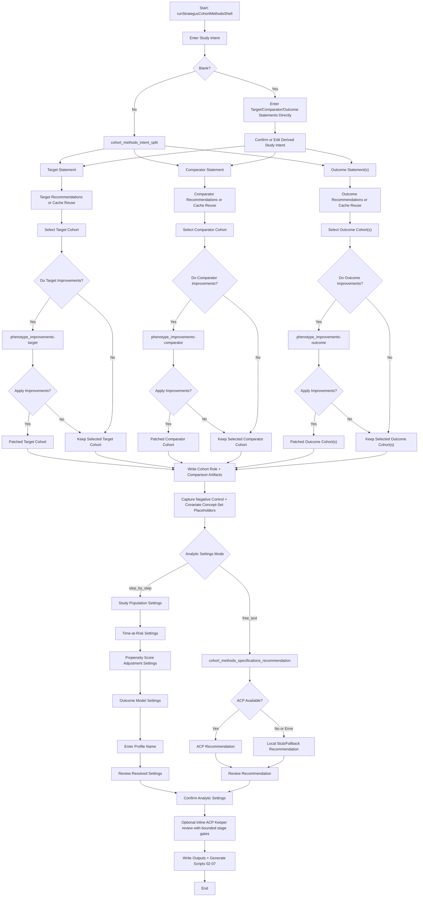
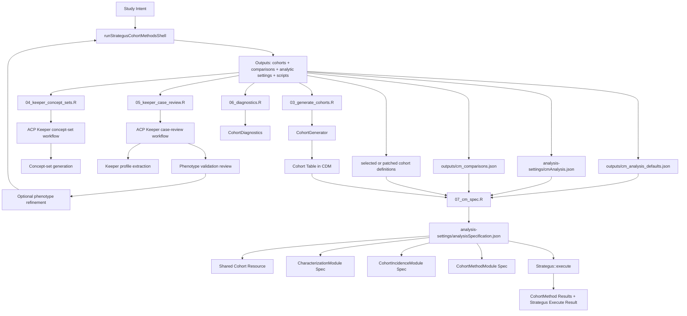

**Cohort Methods Workflow**

Implementation lives in the external [`SlashOhdsiStrategusAssistant`](https://github.com/OHDSI/SlashOhdsiStrategusAssistant) R package; this document describes its integration with Study Agent.

This document captures the current cohort-methods workflow implemented by `slashOhdsiStrategusAssistant::runStrategusCohortMethodsShell()` and how it fits into a broader Strategus execution pipeline.

## Shell Workflow (Target/Comparator/Outcome + Analytic Settings)

Build-mode note: interactive users can type `h` at the major design prompts to see step-specific help, `/back` at supported boundaries to revisit the prior step, and `/ohdsi <question>` for contextual guidance.

## Strategus Execution Context

Keeper sequencing note: inline Keeper concept-set preparation may occur during build, but row-level Keeper case review is deferred until cohort generation has completed and rows are available. The shell records `deferred_pending_cohort_generation`; run `03_generate_cohorts.R` before `05_keeper_case_review.R`.

Execution note: `07_cm_spec.R` depends on the cohort-selection and analytic-settings outputs, not on Keeper or diagnostics completion. Keeper and diagnostics remain optional review/enrichment steps that can be run before or after the main CohortMethod specification, or explicitly skipped in the execution menu when that is the intentional workflow choice.

## Current Explicit Limitations

- Negative-control and covariate concept-set workflows are still placeholder-based.
- Cohort-method generation currently materializes only the first comparison from `cm_comparisons.json`.
- ACP analytic-settings recommendations are converted into shell settings, but a dedicated recommendation validation layer is still pending.
