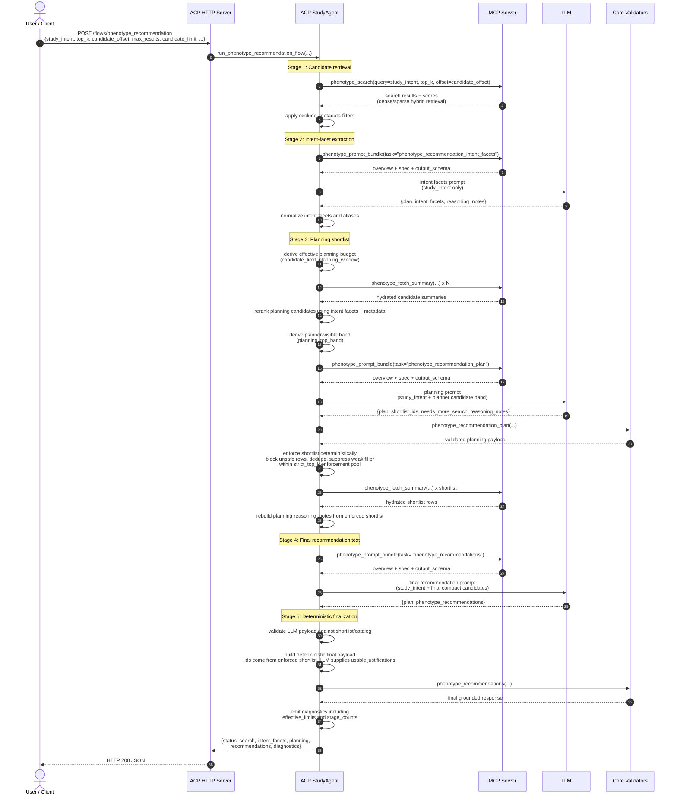
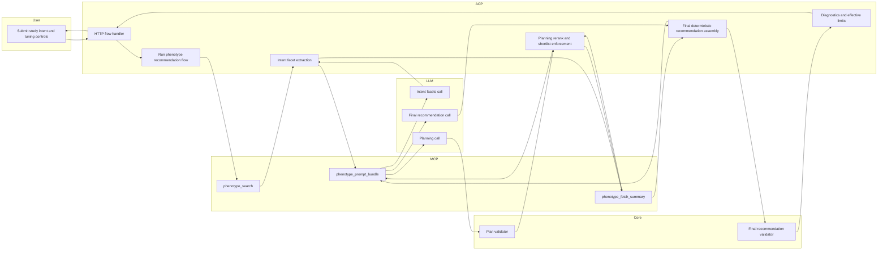

**Overview**
This document defines the `phenotype_recommendation` design in the ACP + MCP architecture. The MCP service owns the phenotype index on local disk and exposes read-only retrieval tools. ACP orchestrates retrieval, multiple LLM calls, deterministic shortlist enforcement, and final response assembly. Core remains pure and deterministic for schema validation and final filtering.

The current ACP request accepts these commonly used fields:
- required: `study_intent`
- retrieval controls: `top_k`, `candidate_offset`
- planning / output controls: `candidate_limit`, `max_results`
- optional routing / filtering: `recommendation_role`, `workflow_type`, `exclude_metadata`

A compact swimlane version with the main responsibility split:

A few implementation notes worth keeping in mind:
- MCP does not rank finally; it only retrieves candidates and prompt assets.
- ACP owns the real decision logic now: reranking, blocking, shortlist enforcement, dedupe, deterministic final ids.
- The final LLM call is advisory for text/justification, not for unconstrained id selection.
- ACP now reports compact guardrail diagnostics in `diagnostics.effective_limits` and `diagnostics.stage_counts` so testing tools can inspect planning and enforcement behavior without re-deriving those limits client-side.
