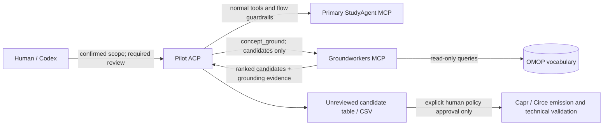

# Groundworkers pilot integration

Groundworkers is an optional, separately deployed candidate provider for the
review-gated `phenotype_make_computable` flow. It never replaces the primary
StudyAgent MCP, creates a concept-set policy, or emits a cohort definition.

The pilot is selected only by a request with
`concept_build_mode: "groundworkers"`, `concept_review_mode: "required"`, and
empty `concept_sets`. The normal `provided_only` emission request remains
review-policy driven and does not call Groundworkers.

For the controlled comparison, the baseline ACP uses its usual candidate
retrieval route; the pilot ACP uses the same confirmed scope with the additional
Groundworkers mode. Preserve the response, review package, and provenance from
each run separately. A candidate result is retrieval evidence, not clinical
validation or approval.
